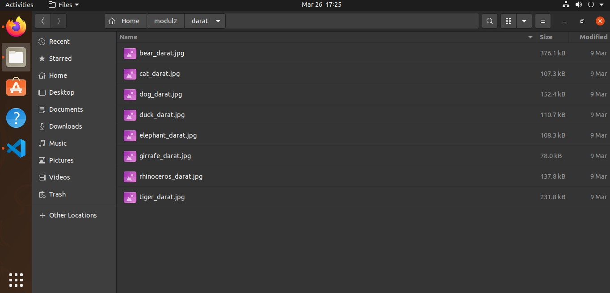
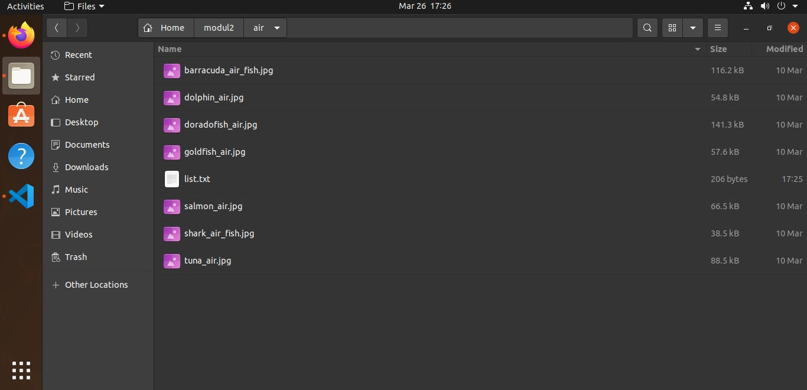
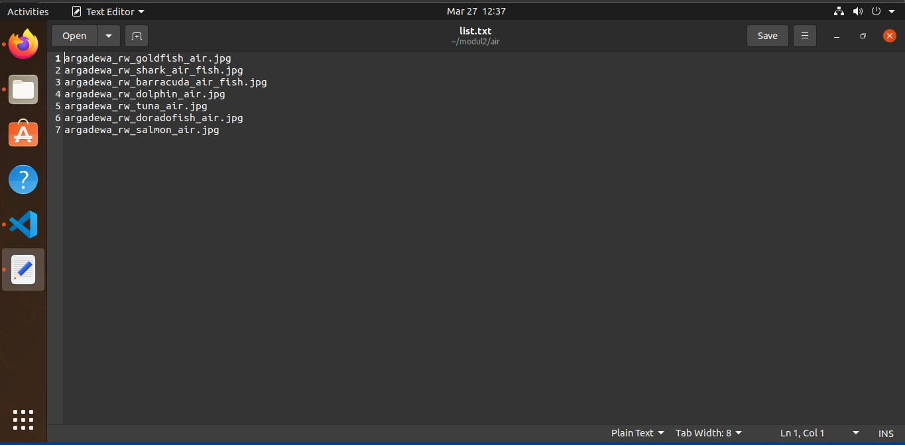

# soal-shift-sisop-modul-2-B05-2022

Kelompok B05 Sistem Operasi B Tahun 2022

Nama Lengkap | NRP
------------- | -------------
Fahmi Muhazir        | 5025201043
Sidrotul Munawaroh   | 5025201047
Rere Arga Dewanata   | 5025201078 

## Jawaban Soal 1
## Soal 1
Mas Refadi adalah seorang wibu gemink.Dan jelas game favoritnya adalah bengshin impek. Terlebih pada game tersebut ada sistem gacha item yang membuat orang-orang selalu ketagihan untuk terus melakukan nya. Tidak terkecuali dengan mas Refadi sendiri. Karena rasa penasaran bagaimana sistem gacha bekerja, maka dia ingin membuat sebuah program untuk men-simulasi sistem history gacha item pada game tersebut. Tetapi karena dia lebih suka nge-wibu dibanding ngoding, maka dia meminta bantuanmu untuk membuatkan program nya. Sebagai seorang programmer handal, bantulah mas Refadi untuk memenuhi keinginan nya itu. 

## Penyelesaian soal 1
### 1a
Pada poin ini kita diminta untuk mendownload file yang menjadi data untuk melakukan proses gacha <br>
Berikut adalah kode untuk mendownload dari url yang diberikan. <br>
```c
void downld(char *url, char *filename){
    pid_t id_child;
    id_child = fork();
    
    if(id_child == 0){
        char *argv[] = {"wget","-q", "--no-check-certificate", url, "-O", filename, NULL};
        execv("/bin/wget", argv);
        exit(EXIT_SUCCESS);
    }
    else if(id_child > 0) {
        wait(NULL);
    }
}

```
Penjelasan kode:
- `pid_t id_child` adalah untuk mengembalikan process ID dari proses saat ini.
- `id_child = fork()` forking kepada id proses yang berjalan. 
- `if(id_child == 0)` adalah jika proses adalah `child`, maka akan masuk `if`.
- `char *argv[]` untuk menampung kata-kata sesuai yang tertulis command line untuk dijadikan parameter pada fungsi `execv()`.
- `execv("/bin/wget, argv")` menjalankan fungsi `wget` dengan parameter yang ada di variable `argv`.
- `else if (id_child > 0)` jika parent, maka masuk else.
- `wait(NULL)` adalah sintaks untuk menunggu hingga child selesai mengeksekusi programnya.

File yang telah di download akan diunzip sesuai dengan ketentuan soal. <br>
Berikut adalah kode untuk meng-unzip dari nama file yang diberikan.
```c
void unzp(char *filename){
    pid_t id_child;
    id_child = fork();
    
    if (id_child == 0) {
        char *argv[] = {"unzip", "-n", "-q", filename, NULL};
        execv("/bin/unzip", argv);
        exit(EXIT_SUCCESS);
    }
    else if (id_child > 0) {
        wait(NULL);
    }
}

```
- penjelasan nya mirip dengan saat mengeksekusi function download namun tujuan program ini adalah unzip
<br>

Selanjutnya, kita diminta untuk membuat direktori yang bernama `gacha_gacha`.
Berikut adalah kode untuk membuat direktori.
```c
void create_dir(char *dirname) {
    pid_t id_child;
    id_child = fork();
    
    if (id_child == 0) {
        DIR *dir = opendir(dirname);
        if (dir)
        {
            closedir(dir);
        } else {
        char *argv[] = {"mkdir", dirname, NULL};
        execv("/bin/mkdir",argv);
        }
        exit(EXIT_SUCCESS);
    }
    else if (id_child > 0) {
        wait(NULL);
    }
}


```
- `DIR *dir = opendir(dirname)` adalah untuk mengecek apakah sudah ada direktori bernama `dirname`, jika ada maka lakukan `closedir()` juga `exit`.
<br>


### 1b, 1c, dan 1d
Terdapat ketentuan gacha seperti berikut:
- Jika counter gacha adalah genap, maka hasilnya adalah `weapons`. Jika ganjil, maka `characters`. 
- Untuk setiap counter gacha kelipatan 10, maka hasil tersebut akan dimasukkan kedalam file dengan format nama `{hh:mm:ss}_gacha_{jumlah-gacha}.txt`. Jarak pembuatan antar file berjarak 1s.
- Untuk setiap counter gacha kelipatan 90, maka hasil tersebut akan dimasukkan kedalam folder dengan format nama `tot_gacha{jumlah-gacha}`.


Berikut adalah kode untuk program gacha pada `int main()`.
```c
int total_gacha = 0;
while (1) {
        time_t timer;
        char template_time[100];
        struct tm *tm_info;
        timer = time(NULL);
        tm_info=localtime(&timer);
        strftime(template_time, 100, "%H:%M:%S", tm_info);
        int round_ten = tot_gacha - (tot_gacha%10);
        char number[5], cur_dir[100];
        sprintf(number,"%d",round_ten);
        strcpy(cur_dir,"gacha_gacha/");
        strcat(cur_dir,template_time);
        strcat(cur_dir, "_gacha_");
        strcat(cur_dir, number);
        strcat(cur_dir, ".txt");
        
        for (size_t i = 0; i < 10; i++)
        {
            tot_gacha++;
            prims(&primogems);
            gacha(tot_gacha, cur_dir);
        }
        sleep(1);
        srand(time(NULL));
    }
}

```
- `char cur_dir[100]` untuk membuat format direktori sesuai ketentuan `tot_gacha{jumlah-gacha}`.
- `sprintf(num_dir, "%d", round_nine)` memformat int `round_nine` kedalam string lalu disimpan didalam variable `num_dir`.
- `for (int j = 0; j < 9; j++)` untuk looping per 1 folder (kelipatan 90).
- `time_t timer` untuk menggunakan fungsi `localtime()` kedepannya.
- `timer = time(NULL)` inisialisasi timer.
- `struct tm *tm` struct untuk memformat time menjadi struct
- `strftime(template_time, 100, "%H:%M:%S", tm_info)` memformat `datetime` sesuai format soal dan menyimpannya kedalam `formatted_time`.
- `for (int i = 0; i < 10; i++)` untuk looping per 10 gacha yang akan dimasukkan kedalam 1 file .txt.
- `srand(time(NULL))` untuk mereset `rand()` (didalam function `g_rand()`).


Fungsi ini akan dijalankan setiap kali fungsi `gacha()` akan dipanggil. Fungsi ini akan mengurangi `primogems` hingga dibawah batas gacha yaitu 160. <br>
Jika nilai `primogems` dibawah 160, maka program akan menunggu hingga waktu yang ditentukan. Penjelasan lebih lanjut akan diberikan di poin 1e.

Untuk kode dari function `gacha()` adalah sebagai berikut.
```c

void gacha(int count, char cur_dir[100]){ 

    int max;
    char path[100];
    DIR *dp;
    struct dirent *ep;
    char path_r[100];
    char ty_item[100];

    if(count%2==0){
        max = 130;
        strcpy(ty_item,"Weapons");
        strcpy(path, "weapons/");
    } else {
        max = 48;
        strcpy(ty_item,"Characters");
        strcpy(path, "characters/");
    } 
    dp = opendir(path);

    int random = g_rand(max);
    if(dp != NULL)
    {
        for (int j = 0; j <= random; j++){
            ep = readdir(dp);
        }
        strcpy(path_r, ep->d_name);
        ep = NULL;
        closedir(dp);
    } else {
        perror("Can't Open Directory");
    }
    // Baca json
    strcat(path, path_r);
    char buffer[4096];
    struct json_object *parsed_json;
    struct json_object *rarity;
    struct json_object *name;
    FILE *fp;

    fp = fopen(path, "r");
    fread(buffer, 4096, 1, fp);
    fclose(fp);

    parsed_json = json_tokener_parse(buffer);
    json_object_object_get_ex(parsed_json, "name", &name);
    json_object_object_get_ex(parsed_json, "rarity", &rarity);

    FILE *gacha_file;
    char insert_into_file[100];
    char num[5], primo[10];
    sprintf(num, "%d",count);
    sprintf(primo, "%d",primogems);

    gacha_file = fopen(cur_dir, "a");

    strcpy(insert_into_file,num);
    strcat(insert_into_file,"_");
    strcat(insert_into_file,ty_item);
    strcat(insert_into_file,"_");
    strcat(insert_into_file,json_object_get_string(rarity));
    strcat(insert_into_file,"_");
    strcat(insert_into_file,json_object_get_string(name));
    strcat(insert_into_file,"_");
    strcat(insert_into_file,primo);
    strcat(insert_into_file,"\n");

    fputs(insert_into_file,gacha_file);
    fclose(gacha_file);
}

```
Dengan parameter `count` berupa total gacha yang sudah diakukan dan `cur_dir[100]` untuk path ke file yang diinginkan.
- Variable `max`, `item_type`, dan `path` merupakan jumlah file yang ada di folder `weapons/` ataupun `characters/`. Nilai kedua variable tersebut akan diisi bergantung dari variable `count`. Jika `count` adalah genap, maka set dengan ketentuan dari `Weapons`. Dan jika genap, isi dengan ketentuan dari `Characters`.
- `max` adalah jumlah dari file pada path tertentu (untuk `weapons/` adalah 130, dan untuk `characters/` adalah 48). Ditentukan secara manual.
- Terdapat `struct json_object` untuk menampung hasil json dari file .json yang diambil. Terdapat juga beberapa fungsi header `<json-c/json.h>` seperti mengambil hasil, mem-parse string json, dan lainnya.
- Pada bagian terakhir dari kode berfungsi untuk menuliskan hasil gacha sesuai format `{jumlah-gacha}_[tipe-item]_{rarity}_{name}_{sisa-primogems}` kedalam file dengan path berdasarkan variable `cur_dir`

Penamaan path untuk folder dan file terdapat pada `int main()` yang nantinya akan dipassing kedalam fungsi `gacha()`. <br>
Untuk kode penamaan folder/file adalah sebagai berikut.
```c
while (1)
{
    // create dir name
    char cur_dir[100], num_dir[5];
    strcpy(cur_dir, "gacha_gacha/");
    int round_nine = total_gacha - (total_gacha % 90);
    sprintf(num_dir, "%d", round_nine);
    strcat(cur_dir, "tot_gacha");
    strcat(cur_dir, num_dir);
    strcat(cur_dir, "/");
    create_dir(cur_dir);

    for (int j = 0; j < 9; j++)
    {
        // create filename
        time_t timer;
        char formatted_time[100], number[5];
        char temp_dir[100];
        strcpy(temp_dir, cur_dir);
        struct tm *tm_info;
        timer = time(NULL);
        tm_info = localtime(&timer);
        strftime(formatted_time, 100, "%H:%M:%S", tm_info);
        int round_to_10 = total_gacha - (total_gacha % 10);
        sprintf(number, "%d", round_to_10);

        strcat(temp_dir, formatted_time);
        strcat(temp_dir, "_gacha_");
        strcat(temp_dir, number);
        strcat(temp_dir, ".txt");

        // ...
    }
}
```
Sesuai letak comment, blok kode penamaan folder/file terletak di bawah comment tersebut.

### 1e

Permintaan lain dari soal adalah script akan jalan ketika `30 Maret jam 04:44`. Dan proses zip folder akan dilakukan 3 jam setelah program dijalankan. <br>
```c


...

void prims(int *primo){
    *primo = *primo - 160;
    if(*primo <= 160){
       zp_fd(); 
       d_dir("gacha_gacha");
       d_dir("weapons");
       d_dir("characters");
       end();
    }
}

```
Fungsi `wait_date()` adalah untuk membuat program menunggu hingga waktu yang ditentukan, yaitu `30 Maret jam 04:44`. <br>
Sedangkan cuplikan kode pada fungsi `cek_primo()` membuat program menunggu hingga 3 jam setelah program dimulai.

Pada akhir program, semua folder dan file dalam folder `gacha_gacha/` akan di-zip dan dipassword sesuai ketentuan soal. <br>
Untuk kode zip adalah sebagai berikut.
```c
void zp_fd(){
    pid_t id_child;
    id_child = fork();
    
    if (id_child == 0) {
        char *argv[] = {"zip", "-q", "-r", "-P", "satuduatiga", "not_safe_for_wibu.zip", "gacha_gacha", NULL};
        execv("/bin/zip",argv);
        exit(EXIT_SUCCESS);
    }
    else if (id_child > 0) {
        wait(NULL);
    }
}

```


### Kendala Soal 1
Sudah dibuat beberapa fungsi sesuai dengan permintaan namun tidak dapat berjalan sesuai yang d harapkan.
### Screenshot Soal 1


## Jawaban Soal 2 

### Kendala Soal 2  

### Screenshot Soal 2

## Jawaban Soal 3 

### Kendala Soal 3  

### Screenshot Soal 3
Hasil akhir di directory /home/[USER]/modul2/darat   
  

Hasil akhir di directory /home/[USER]/modul2/air  
     

Hasil akhir di file list.txt pada directory pada directory /home/[USER]/modul2/air/list.txt  
  
